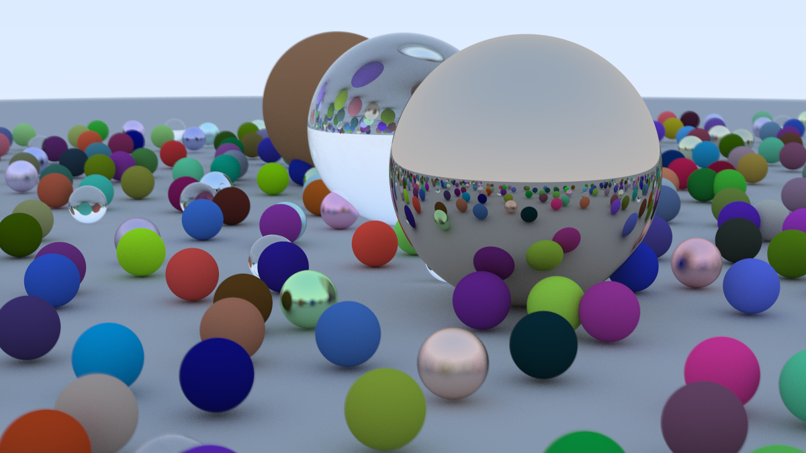

# Raytracing

A raytracing project based on the Ray Tracing in One Weekend books implemented
in C.

## Building

The code can be compiled into a binary with three options. These options work by
passing `-DMAKE_{SDL, PPM, TICE}` to the compiler in order to compile the
correct graphical integration. Multiple flags can be passed manually to build a
binary with support for multiple output formats. When switching between
different outputs `src/graphics.c` will need to be recompiled, which can be done
with `make clean` and the compiling for the prefered target.

### SDL

Building the project for displaying the resulting image with **SDL2** requires
SDL2 and its headers to be installed to the system. SDL2 can be installed with

```bash
pacman -S sdl2  # or
xbps-install SDL2 SDL2-devel
```

Bulding the project itself can then be done with

```bash
TARGET=sdl make
```

### PPM

The project can also be built with support for outputting images in the **PPM**
format. For this, simply compile the code with

```bash
TARGET=ppm make
```

### TICE

At some point I also hope to implement this for the TI-CE calculators, but it so
far lacks support.

## Running

The binary is by default compiled to `bin/main` and can by run directly or with
`make run`.

### PPM

When running a binary compiled with **PPM** output, the file content will be
written to *stdout*. Pipe this into the prefered output file with
`make run > out/result.ppm` or with `make view_ppm` altough this will require
you to configure a method for opening the resulting image in the `makefile`,
`gthumb` is used by default.

### TICE

Running the **TICE** binary will require a ti-ce calculator or emulator but
there is not yet support for this target.

## Results

Below are the final results of the code.

### Ray Tracing in One Weekend



## References

[*Ray Tracing in One Weekend*](https://raytracing.github.io/books/RayTracingInOneWeekend.html)
