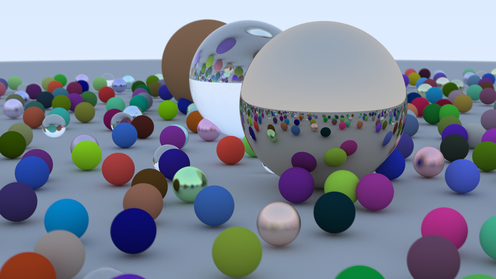

# Raytracing



A raytracing project based on the Ray Tracing in One Weekend series,
implemented in C.

## About

The project is based on the Ray Tracing in One Weekend series authored by
Peter Shirley, Trevor David Black, and Steve Hollasch. The series code is written
in C++. As such, much focus has been put into building algorithms used for
sorting the world objects, and implementing the polymorphism needed for multiple
different textures, materials and shapes to be easily iterated and traced.

### World Containers

Implementing an efficient storage method for tracing shapes has been a point
of focus. The first solution was a custom implemented linked list where world
objects could be added dynamically as pointers to a `Hittable`. This proved a
simple solution although it causes the scene to be iterated in $O(n)$ time.
Later on, this was upgraded to use a bounding volume hierarchy where the scene
was continuously split in half along its longest axis. The creation of the `Bvh`
object prompted the implementation of a merge sort algorithm in order to split
the scene of hittables in half. The `Bvh` reduced the time to iterate the scene
to $O(log n)$.

### Polymorphism

The `Hittable` base structure is an example of how polymorphism has been
implemented for this project where all `Hittable` types must implement specific
fields in their respective data structures using the `DERIVE_HITTABLE()` macro.
For example, the `Sphere` structure must first derive the hittable fields before
fields specific to the sphere shape can be created. The same is also true for
both `Material` and `Texture`.

```c
#include "hittable."

typedef struct {
    DERIVE_HITTABLE()

    Vec3 center;
    Vec3 dcenter;
    double radius;
} Sphere;
```

## Building

### Dependencies

The project only supports a SDL frontend at the moment. Thus, it is required to
install sdl2 and its headers. The project also optionally depends on `stb_image`
in order to load image textures, this dependency is automatically configured
when building the project and can be opted out of using `CONFIG_STB_IMAGE`.

### Configuration Options

The binary can be built with two configuration options, `CONFIG_FRONTEND` and
`CONFIG_STB_IMAGE`. These options can be set through the terminal or `.config`.

> Changing any of the options will require the project to be rebuilt with
> `make all`

`CONFIG_FRONTEND` default is sdl and it can only be set to sdl.

`CONFIG_STB_IMAGE` default is 'y' but can be used to opt out of the `stb_image`
dependency by setting it to 'n'. This will cause image textures to give a
warning and display black and magenta checkers.

### Make Targets

```bash
git clone https://github.com/mes3n/raytracing.git
cd raytracing

pacman -S sdl2
```

The default build process also fetches and precompiles the `stb_image` header.
Therefore, it is also **not** necessary to define the `STB_IMAGE_IMPLEMENTATION`
in any other file using the header although the built object file must also be
linked into the target.

```bash
make  # build project with defaults
make clean  # remove binaries
make reset  # remove downloaded dependencies
```

```bash
echo "CONFIG_STB_IMAGE=n" > .config
make  # build without fetching stb_image headers
make reset
```

### Running

The generated binary should be located in `bin/main`.
Run `./bin/main -h` for options when raytracing the image.

## References

[_Ray Tracing in One Weekend_](https://raytracing.github.io/books/RayTracingInOneWeekend.html)
